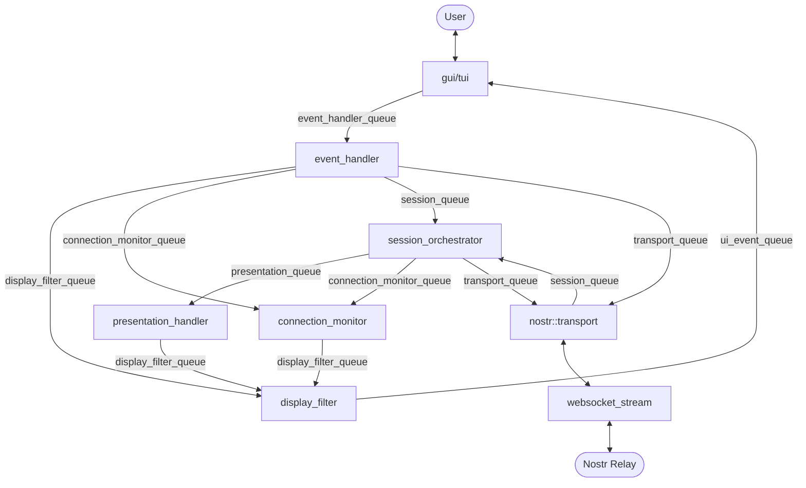

# Architecture

Radix Relay implements a layered architecture for hybrid mesh communications.

## Processor and Queue Architecture

The system uses async message queues to connect processors. Each processor owns exactly one input queue and can send messages to any other processor's queue.

## Key Components

### User Interface Layer

**Graphical UI (GUI)** - Modern graphical interface built with Slint framework:

- Cross-platform support (Windows, macOS, Linux)
- Message scrolling with auto-scroll
- Bundled fonts for consistent appearance

**Terminal UI (TUI)** - Command-line interface for headless environments and SSH sessions.

Both interfaces share the same backend event system and provide identical functionality.

### [Signal Protocol](signal-protocol.md)

End-to-end encryption with forward and future secrecy using X3DH key agreement and Double Ratchet algorithm.

### [Transport Layer](transport-layer.md)

Unified interface for multiple transport mechanisms (Nostr, BLE, and future protocols).

### [Hybrid Routing](hybrid-routing.md)

Intelligent routing that prefers internet connectivity but seamlessly falls back to mesh networking.

## Design Principles

1. **Security First** - All messages encrypted end-to-end
2. **Resilient** - Works with partial infrastructure
3. **Modular** - Clean separation between layers
4. **Extensible** - Easy to add new transports
