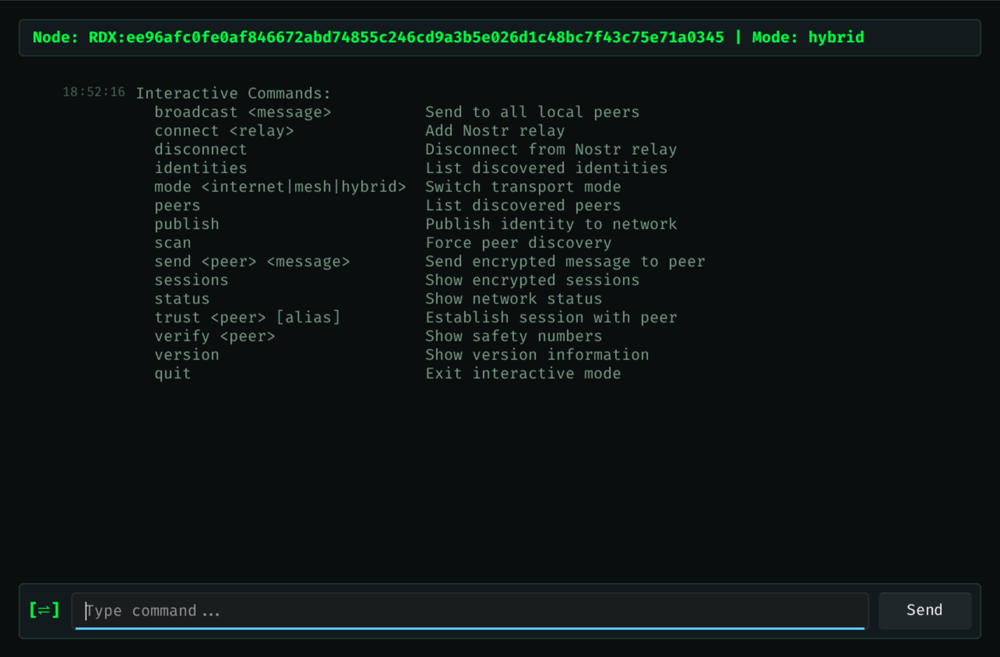

# [⇌] Radix Relay

**Hybrid mesh communications when it matters most**

Open-source communications system combining internet (Nostr) and local mesh (BLE) transports with Signal Protocol encryption for activists, disaster response, and infrastructure-independent communications.



---

## Features

### Hybrid Transport

Automatic failover between internet (Nostr) and local mesh (BLE) networks. Stay connected even when infrastructure fails.

### Signal Protocol Encryption

End-to-end encryption with perfect forward secrecy. Your messages remain secure even if keys are compromised.

### Cross-Platform

Built with modern C++ and Rust, supporting Linux, Windows, and macOS.

### Emergency Focus

Designed for activists, disaster response teams, and anyone who needs reliable communications when traditional infrastructure is unavailable.

---

## Quick Start

```bash
# Clone the repository
git clone https://github.com/dustingooding/radix-relay.git
cd radix-relay

# Install dependencies
# See Installation guide for details

# Build
cmake --preset=unixlike-clang-debug
cmake --build --preset=unixlike-clang-debug

# Run tests
ctest --preset=test-unixlike-clang-debug
```

[Get Started →](getting-started/index.md){ .md-button .md-button--primary }
[View on GitHub](https://github.com/dustingooding/radix-relay){ .md-button }

---

## Security Notice

!!! warning "Pre-Release Software"
    This is pre-release software under active development. **Do not use for sensitive communications** until Phase 1 security audit is complete.

For security issues, please email [radix-relay@proton.me](mailto:radix-relay@proton.me) or create a private security advisory on GitHub.

---

## Project Status

**Phase 1A Complete** - Nostr + Signal Protocol functional

- ✅ Signal Protocol (X3DH, Double Ratchet, Kyber)
- ✅ Key management and rotation
- ✅ Nostr transport (WebSocket, TLS)
- ✅ Message encryption/decryption
- ✅ Session establishment and messaging
- ✅ Contact management
- ✅ Slint GUI with terminal aesthetic
- ✅ TUI for command-line usage

**Phase 1B Planned** - BLE transport

- 📋 BLE device discovery
- 📋 BLE mesh networking
- 📋 Hybrid routing (auto-failover)

---

## License

This project is licensed under the GNU Affero General Public License v3.0.

See the [LICENSE](https://github.com/dustingooding/radix-relay/blob/main/LICENSE) file for details.

---

## Community

- **GitHub**: [dustingooding/radix-relay](https://github.com/dustingooding/radix-relay)
- **Issues**: [Bug Reports & Feature Requests](https://github.com/dustingooding/radix-relay/issues)
- **Security**: [radix-relay@proton.me](mailto:radix-relay@proton.me)
